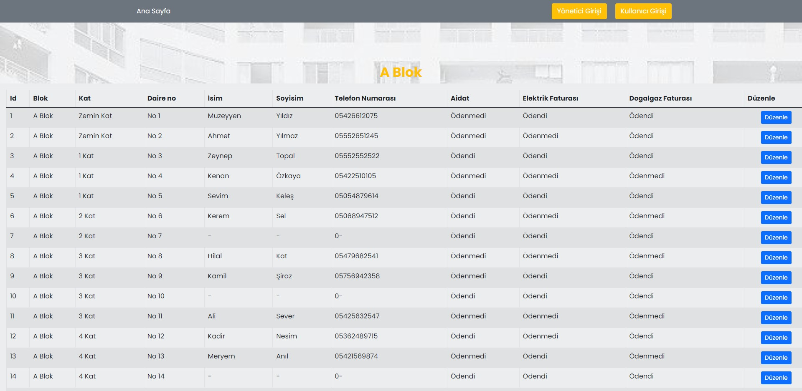
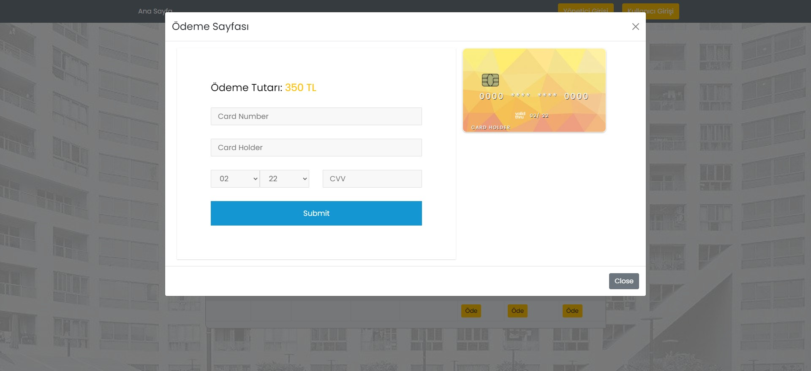

# Site Management App
### Akbank FullStack Bootcamp Graduation project

## Features 
- ASP .NET CORE Web API
- MSSQL
- Swagger Ui
- React Js
- React Hooks
- Custom Hook
- React Router
- Redux
- React Bootstrap
- Axios
- Hunel React Credit Card (https://www.npmjs.com/package/reactjs-credit-card)

  
## Frontend Screens

#### Home Page

#### Admin Login Page

#### Tenants List Page

#### Edit Tenant Modal

#### Tenants Login Page

#### Choose Tenant

#### Tenant Information Page

#### Credit Card Modal

 ## API Screens

#### Swagger UI Page

#### Database Diagram

## Demo
 
#### Admin Operations

#### Tenant Operations

Thanks for reading!

  